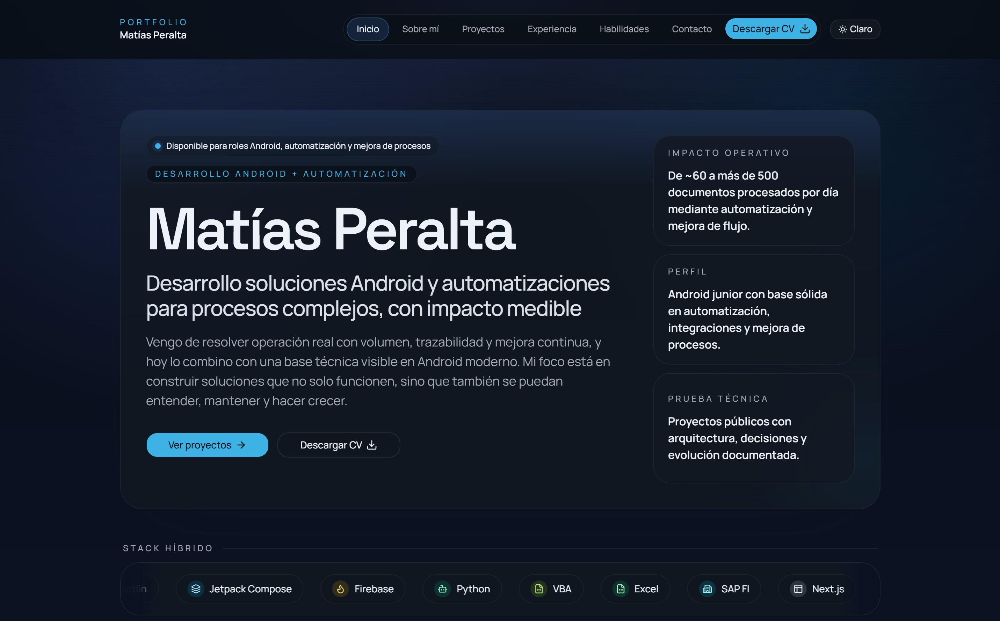
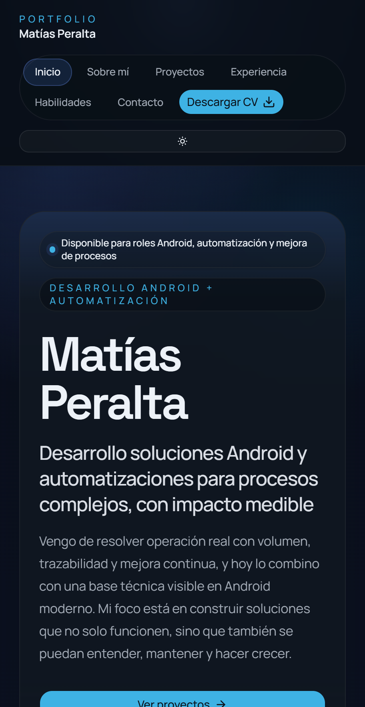
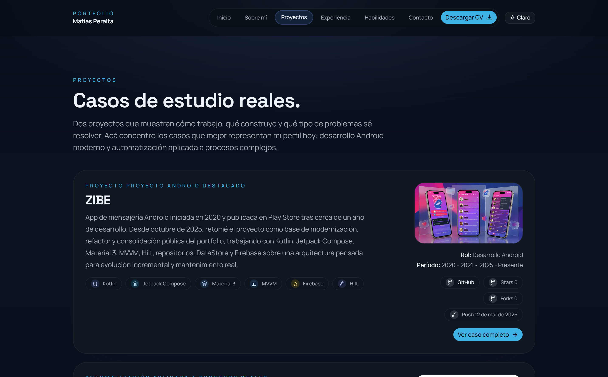

# ✨ Portfolio — Matías Peralta

> Portfolio profesional desarrollado con **Next.js, TypeScript y contenido local**, pensado para mostrar proyectos, experiencia y una forma de trabajo basada en **iteración real, criterio técnico y documentación por features**.  
> Este repositorio funciona al mismo tiempo como **portfolio profesional**, **evidencia técnica** y **muestra de criterio de producto**.

---

## 🛠️ Stack


---

## 🎯 Objetivo

El objetivo de este portfolio es comunicar de forma simple y profesional:

- 👤 quién soy
- 🧩 qué tipo de problemas resolví
- ⚙️ qué stack uso
- 🧠 cómo pienso y construyo software
- 📁 qué proyectos representan mejor mi perfil hoy

No está planteado como un sitio de autopromoción vacía, sino como un **portfolio técnico con criterio de producto**.

---

## 🚀 Qué muestra hoy

Actualmente el proyecto incluye:

- ✅ Home madura con narrativa profesional principal
- ✅ Páginas internas con contenido real en español
- ✅ Proyectos públicos curados con contenido local
- ✅ Perfil, experiencia y recorrido con foco técnico-profesional
- ✅ Assets reales para perfil, proyectos y CV
- ✅ Soporte dark/light con criterio visual consistente
- ✅ Metadata opcional preparada para futuras integraciones
- ✅ Documentación y specs por feature para acompañar la evolución del proyecto

---

## 🧭 Sobre el proyecto

Este portfolio no busca ser solo una landing personal.  
Está construido como una pieza pública que combina presentación profesional y una forma de trabajo documentada.

A medida que el proyecto fue creciendo, se trabajó en:

- narrativa profesional más clara y menos genérica
- contenido real en español
- refinamiento visual incremental
- consistencia entre páginas y componentes
- documentación por features
- una base preparada para crecer sin perder orden

---

## 🖼️ Preview

### Home


### Mobile


### Projects


---

## 🧩 Enfoque de construcción

El proyecto sigue algunas decisiones base:

| Decisión | Descripción |
|---|---|
| 📄 Contenido local | El contenido vive dentro del repo y no depende de un CMS externo. |
| 📐 Trabajo guiado por specs | Las mejoras relevantes se acompañan con documentación de alcance, plan y validación. |
| 🔁 Iteración real | El portfolio fue evolucionando mediante features pequeñas y revisables. |
| 🌑 Dark-first | La experiencia visual fue pensada primero para modo oscuro, con soporte para tema claro. |
| 🔌 Base extensible | Preparado para sumar nuevas secciones, metadata viva y contacto sin romper la estructura. |

---

## 📁 Estructura general
```text
src/
  app/
  components/
  content/
  lib/
  types/
public/
  files/
  images/
  og/
docs/
specs/
```

---

## 📦 Desarrollo local
```bash
npm install
npm run dev
npm run lint
npm run build
```

---

## 🧠 Fuente de verdad

La fuente de verdad del proyecto está distribuida así:

| Carpeta | Contenido |
|---|---|
| `src/content/` | Contenido local del portfolio |
| `docs/` | Contexto, decisiones y material complementario |
| `specs/` | Alcance, plan y verificación de features |

Esto permite mantener alineados: contenido · implementación · documentación · evolución del proyecto.

---

## 🧪 Forma de trabajo

Este repo refleja una forma concreta de construir:

- features iteradas en lugar de cambios masivos
- documentación que acompaña decisiones reales
- refinamiento progresivo de UI y contenido
- foco en legibilidad, estructura y mantenimiento

---

## 🤝 Nota final

Este repositorio busca funcionar al mismo tiempo como:

> 🗂️ **portfolio profesional** · 🔬 **evidencia técnica** · 🎯 **muestra de criterio de producto** · 🔁 **ejemplo de trabajo iterativo y documentado**